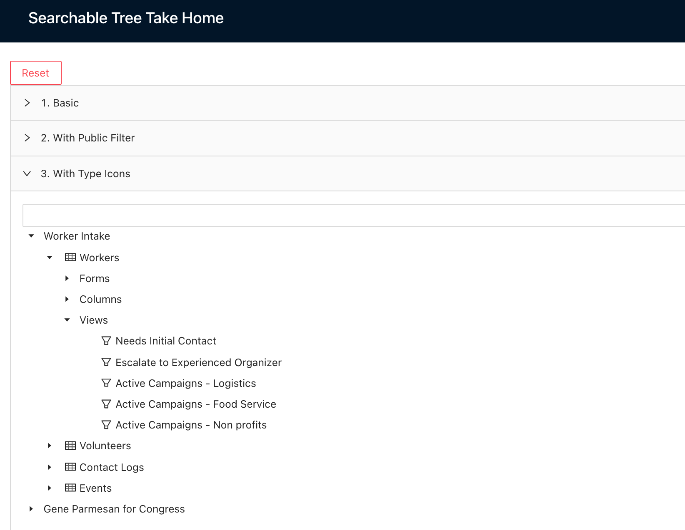
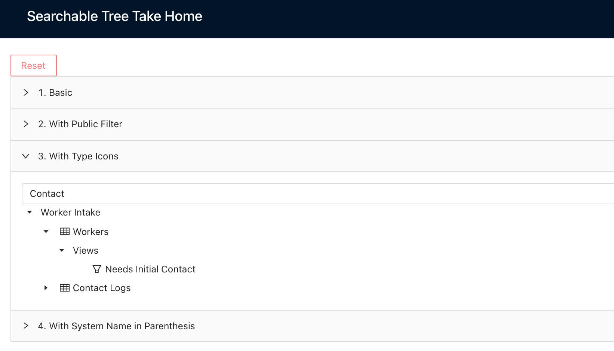

# Rewired: Searchable Tree Take Home 
## Objective
Build a searchable tree that filters according to the search results. Panel 1 is the basic search. Panel 2, adds in an additional filter for if the data is public or private. Panel 3, adds in icons for the tree. Paneel 4, adds in the system names to be displayed with the display names. 

## Getting Started
1. `npm install` to install all dependencies.
2. `npm start` to start up the app.
3. Enter a word into the text field and the tree only display the results that match.
4. Press "Reset" to enter another word and try again.

## Screenshots
Before search the entire tree is displayed.

Tree filtered by search word "Contact" and maintains its path.

## Results
The project works as expected. When user types into the search field, it will filter the tree to show the matching results with its path in tack. The different panels works as expected and filters or display the data in the specified way. I ended up using the full alloted time (3hrs) for the project and had one error left that if I had more time, I would have fixed. The error is that the search doesn't work properly if the user deletes the word. I put in a temporary fix by adding a "reset" button. So when pressed, it resets the app to its initial condition. Also if I had more time I would have added test causes to see if my code breaks with different data and different conditions. I had manually tested the results to confirm that it was displaying the results correctly. Overall I enjoyed working on this project and hope to hear some feedback on it.